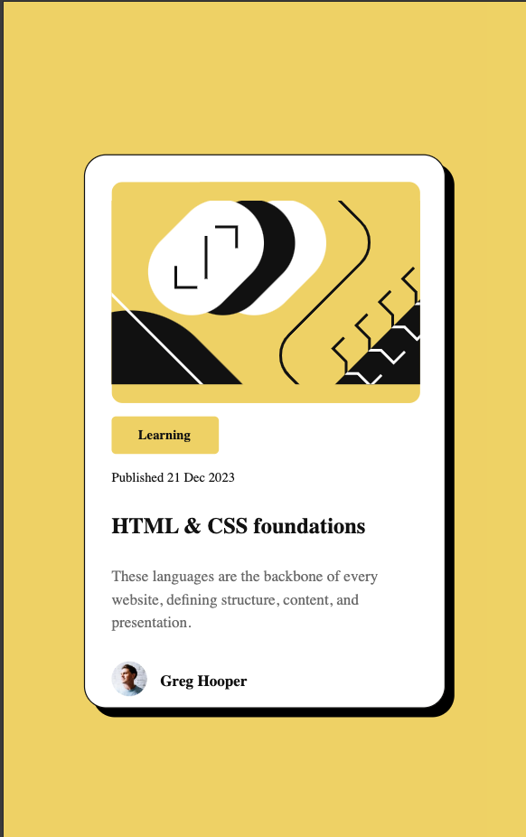

# Frontend Mentor - Blog preview card solution

This is a solution to the [Blog preview card challenge on Frontend Mentor](https://www.frontendmentor.io/challenges/blog-preview-card-ckPaj01IcS). Frontend Mentor challenges help you improve your coding skills by building realistic projects. 

## Table of contents

- [Overview](#overview)
  - [The challenge](#the-challenge)
  - [Screenshot](#screenshot)
  - [Links](#links)
- [My process](#my-process)
  - [Built with](#built-with)
  - [What I learned](#what-i-learned)
- [Author](#author)

## Overview

### The challenge

Users should be able to:

- See hover and focus states for all interactive elements on the page

### Screenshot
## Desktop 

## Mobile 

### Links

- Live Site URL: [https://responsive-blogcard.netlify.app/](https://responsive-blogcard.netlify.app//)

## My process

### Built with

- Semantic HTML5 markup
- CSS custom properties
- Flexbox

### What I learned

##### 1) Understanding the Document Structure:
 By creating this HTML page, you improved your knowledge of document structure and semantics. For example, the use of main, h1, and p tags follows best practices, making your code more readable and accessible.

##### 2) Image Integration:
You worked with images (img tag) effectively, using alt attributes to ensure the content is accessible and SEO-friendly. This teaches you the importance of providing meaningful descriptions for non-visual browsers.

##### 3) Content Organization with Divs:

You learned how to group elements using div for better layout control. Each section (category, content, and author) is well-organized, making it easier to style with CSS.
##### 4) Linking External Resources:

You included external stylesheets and icons, improving your understanding of linking resources in an HTML document.
##### 5) Responsive Design with the meta Viewport:

By using the meta tag for viewport configuration, you ensured that the blog card is responsive, adjusting its layout on different devices.

## Author

- Frontend Mentor - [@kestsaurav21](https://www.frontendmentor.io/profile/kestsaurav21)

